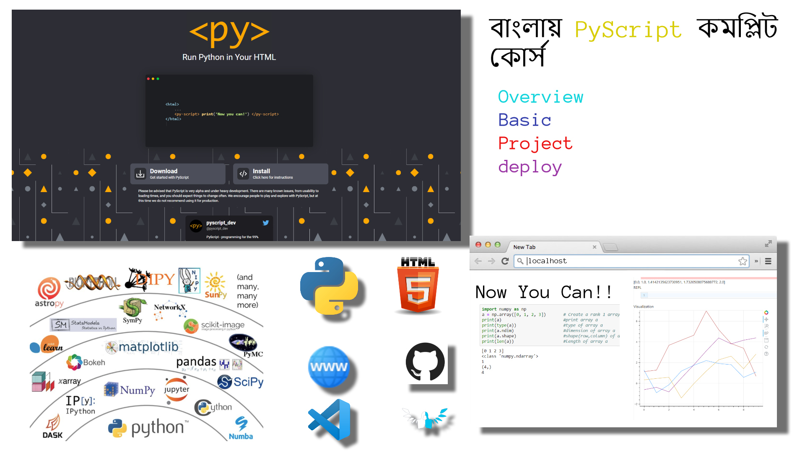

# PyScript
We Took all Of this information from Official Pyscript GitHub Repo. 

you can see our complete tutprial video here. 


[Play Video](https://www.youtube.com/watch?v=9tBKUgQ-IlI)
## What is PyScript

### Summary
PyScript is a Pythonic alternative to Scratch, JSFiddle or other "easy to use" programming frameworks, making the web a friendly, hackable, place where anyone can author interesting and interactive applications.

To get started see [GETTING-STARTED](GETTING-STARTED.md).

For examples see [the pyscript folder](pyscriptjs).

### Longer Version
PyScript is a meta project that aims to combine multiple open technologies to create a framework for users to use Python (and other languages) to create sophisticated applications in the browser. It highly integrates with the way the DOM works in the browser and allows users to add logic, in Python, in a way that feels natural to web as well as Python developers.

## Try PyScript

To try PyScript, import the appropriate pyscript files to your html page with:
```html
<link rel="stylesheet" href="https://pyscript.net/alpha/pyscript.css" />
<script defer src="https://pyscript.net/alpha/pyscript.js"></script>
```
At that point, you can then use PyScript components in your html page. PyScript currently implements the following elements:

* `<py-script>`: that can be used to define python code that is executable within the web page. The element itself is not rendered to the page and only used to add logic
* `<py-repl>`: creates a REPL component that is rendered to the page as a code editor and allows users to write code that can be executed

Check out the [pyscriptjs/examples](pyscriptjs/examples) folder for more examples on how to use it, all you need to do is open them in Chrome.

## How to Contribute

To contribute:

* clone the repo `git clone https://github.com/pyscript/pyscript`
* cd into the main project folder with `cd pyscriptjs`
* install the dependencies with `npm install` - make sure to use nodejs version >= 16
* run `npm run dev` to build and run the dev server. This will also watch for changes and rebuild when a file is saved

## Resources

* [Discussion board](https://community.anaconda.cloud/c/tech-topics/pyscript)
* [Home Page](https://pyscript.net/)
* [Blog Post](https://engineering.anaconda.com/2022/04/welcome-pyscript.html)

## Notes

* This is an extremely experimental project, so expect things to break!
* PyScript has been only tested on Chrome, at the moment.

## Governance

The [PyScript organization governance](https://github.com/pyscript/governance) is documented in a separate repository.
